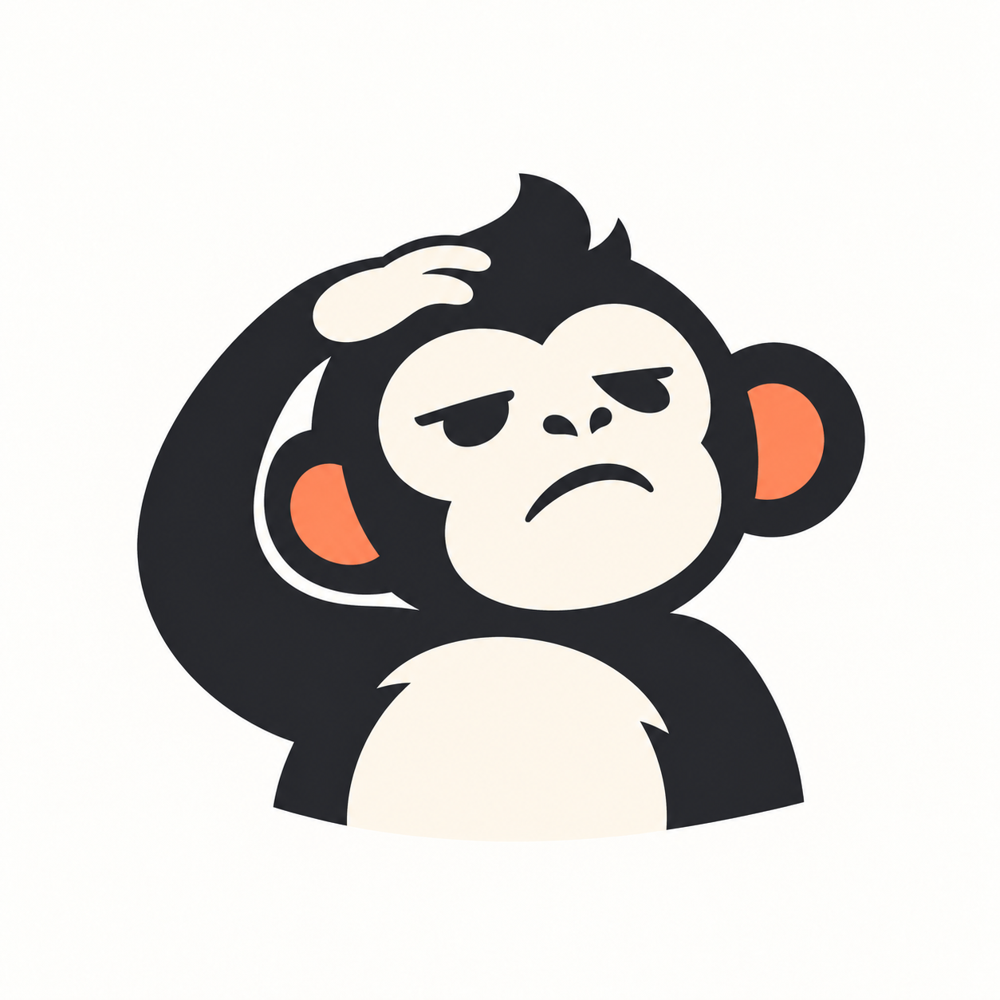

<p align="center">
  
</p>

<h1 align="center">MaaLow</h1>

<p align="center">
  <b>MaaLow — Teachable Low-Code Automation on MaaFramework</b><br>
  基于 MaaFramework 的可教学低代码视觉自动化平台。
</p>

## 定位

MaaLow 让用户通过**自然语言指导 + 屏幕标注**快速创建游戏或应用自动化，不需要手工编写大量 Pipeline。

核心理念：

> **先教它怎么做，再让它自己做。**

## 核心结构

```text
MaaLow
├─ Workspace
├─ Teaching（任务 · 对话 · 附件；舞台：实时截图 / 录像回放 / 远程操控）
├─ Recorder（录像）
├─ Skills
├─ Memory
├─ AI Assistant
└─ MaaFramework
   ├─ OCR
   ├─ Template / Color / CV
   ├─ Pipeline
   └─ Click / Swipe / Key
```

## Workspace

每个游戏或应用都是独立 Workspace，保存自己的任务、模板、Pipeline、技能、教学记录和配置。

设备上同一时间只有一个“当前工作区”，指导、录制、守护规则和不指定工作区的运行都用它。只有网页能切换和管理工作区：顶栏左侧切换；“工作区”页可以新建（从平板已安装的应用里选游戏）、重命名、复制（副本里的定时任务默认停用）、换游戏、导出 / 导入 zip、删除。删除的工作区进回收站（平板上的 `workspaces/.trash/`），保留 7 天。当前工作区不能删；正在录制或运行时不能切换、改名、删除。App 首页只显示当前工作区，网页切换后会跟着变。

## 运行形态

* MaaLow 以伴生 App 的形式运行在平板上，数据（工作区、截图、录像、标注）都存在平板本地。
* App 自带网页管理界面，由平板本机托管，电脑浏览器通过 tailscale 访问。截图和录像按需拉取；指导页的远程舞台可以实时看画面、接管操作，需要 HTTPS（见“远程操控”）。
* 网页有三页：概览（设备、守护规则、定时任务、最近运行、保活检查）、指导（舞台 + 对话）、工作区。顶栏从左到右是工作区切换、控制权指示位、页面切换、主题切换；浅色 / 深色跟随系统，也可以手动切换。
* 守护规则在游戏前台、没有任务运行时巡检，只放随时可能冒出来的画面；流程里才出现的弹窗用流程节点的 `[JumpBack]`。网页上逐条启用 / 停用（总开关之外）、拖动排序（按顺序，命中一条就执行）、设各自的巡检频率（不设就用全局 `guard_interval_ms`）、移出；只能从候选里添加：节点 JSON 写 `"guard_candidate": true` 才是候选。停用、顺序和频率记在 `workspace.json` 的 `extra.guards_off`、`extra.guards_order`、`extra.guard_intervals`，只有 `guards` 里的会被巡检。概览页的“规则文件 / 模板 / 技能”可以点开浏览：节点说明和 JSON、模板缩略图和用到它的节点、技能说明和源码。
* App 首页列出网页链接（设置了 HTTPS 地址时它排第一，然后是局域网、热点等；不列 Tailscale / VPN 地址，远程访问走 HTTPS），每个都能复制、显示二维码、系统分享；Token 可以单独复制，也可以重置（旧链接和 PC 端配置立即失效）。
* 图标和配色来自吉祥物 `mascot.png`，改了图之后用 `uv run python android/scripts/gen_icons.py` 重新生成 App 图标和网页 logo。
* 热更新：Pipeline 规则、模板图、ONNX 模型、Skill 脚本更新都不需要重装 App。

## Teaching Mode

指导就是跟 AI 对话：老师发消息，AI 看懂、动手、回复。画面在“舞台”上看、在舞台上取，截图和录像都当作消息的附件。

```text
数据（存下来的）
工作区
├─ 任务（explore 草稿 + 具名任务）
│  ├─ 对话：消息 → 附件（老师和 AI 都能带）
│  ├─ 截图（shot 附件的图片文件，属于任务）
│  └─ 步骤 / 产出
├─ 录像（属于工作区，可以被多个任务的消息引用）
└─ Pipeline / 模板 / Skill / 守护

舞台（看画面、取素材的地方，本身不存数据）
├─ 实时截图 → 产出 shot 附件
├─ 录像回放 → 产出 recording 附件
└─ 远程操控 → 实时看画面、接管后直接操作（不产出附件，“截一张”进托盘）

设备级
└─ 控制权：老师（远程操控）/ AI / 任务 / 守护
```

用户主要通过自然语言指导，例如“点击领取。”“这个页面出现后先关闭弹窗。”“跟着队友走，结束后找宝箱。”必要时在截图或录像帧上标注（点击点、框、圈、箭头、区域，加文字说明）。MaaLow 把

```text
当前画面 / 录像里的那几帧
+ 用户语言
+ 视觉标注
+ 执行动作
+ 执行结果
```

转换成可重复执行的 MaaFramework 规则。

### 任务

一个任务就是教的一件事（如“每日签到”），跟用哪个舞台无关。对话、步骤、截图都归它，存在 `teaching/<任务>.chat.jsonl`、`<任务>.json` 和 `<任务>/` 截图目录；另存或改名时截图跟着一起搬。

`explore` 是草稿：App 启动后、结束任务后都回到这里，随便试、随便问。草稿里试出了想要的东西，就“另存为任务”（对话、步骤、截图整个改名过去，草稿变回空白）；不要了就“清空草稿”。

任务放在对话栏顶上，和舞台工具栏同高：左边是当前任务名，点开是任务列表（搜索、“新任务”、草稿排第一，其余按最近使用；每项写着步数、对话条数、上次使用），右边是“N 步 · M 条”和 ⋯ 菜单（草稿：“另存为任务”“清空草稿”；任务：“结束任务”（保存并回到草稿）、“删除任务”）；AI 也可以用 `maalow do task <名字>` 切换。每次切换都会在两边的对话里留一条分隔线，网页上的操作也会通过 listen 告诉 AI。结束任务不会自动生成 Pipeline，需要时在对话里让 AI 生成。

录像不归任务，归工作区，只被消息引用。删录像只能在录像列表里删，引用它的消息显示“录像已删除”。

### 对话与附件

一条消息可以只有文字，也可以带多个附件，但不能两样都没有。老师和 AI 的消息是同一种格式，网页也用同一套方式显示。`teaching/<任务>.chat.jsonl` 每行一条：

```jsonc
{ "id": 123, "time": "...", "role": "teacher",   // teacher | ai | system
  "text": "...",
  "attachments": [
    { "type": "shot", "file": "teaching/<任务>/0042.png", "text": "这张图的说明",
      "annotations": [{ "kind": "rect", "coords": [x, y, w, h], "label": "这个标注的说明" }] },
    { "type": "recording", "rec": "20260930-1412", "text": "这段录像的说明",
      "focus": { "from": 1800, "to": 1900 } }       // focus 可选；只看一帧时 from = to
  ] }
```

* **说明分三层**：消息的 `text` 是这条消息的总体说明；每个附件有自己的 `text`（这张图、这段录像要看什么）；每个标注有自己的 `label`。三层都可以空着
* **shot**：一张截图，标注跟着这张图存在消息里。坐标 1080×720，标注种类（点击点、框、圈、箭头、区域）两种舞台通用
* **recording**：只存录像的引用和可选的 `focus`（帧号范围）。逐帧标注在 `recordings/<id>/labels.json` 里，不复制进消息。`focus` 只是提示“我说的是这附近”，不限制能看哪些帧
* **旧消息**：旧格式的 `image + annotations` 读的时候当成一个 shot 附件，旧文件不用改
* **发出即定稿**：消息发出后不能撤回、不能删附件，发错了就在下一轮更正
* **显示**：shot 是缩略图叠标注（编号加说明），点开看大图和每个标注的说明；recording 是一张卡片，写着名称、时长、focus，点开跳到录像舞台的那个位置；附件的说明写在它下面。对话只显示最近 200 条，更早的点“加载更早的消息”

**待发托盘**：舞台上取的截图和录像先进输入框上方的托盘，每一项显示缩略图、标注数和说明的开头。点 ✎ 把它重新载入舞台，画面、标注、说明（录像是范围和说明）都能接着改，改动自动写回这一项，正在编辑的那一项高亮；点 × 删掉。只有托盘里的附件能改能删。托盘按任务存在 App 里（`teaching/<任务>.tray.json`），刷新页面、换一台电脑都还在，几个页面看到的是同一个托盘；另存或改名时跟着任务走。托盘清空或截图被删时，没发出去的截图文件一并清理。

### 舞台

指导页左边是舞台，右边是对话，中间的分隔线可以拖动（比例存在浏览器里；对话栏窄于 280px、舞台窄于 480px 就折叠成窄条，双击分隔线恢复）；竖着拿的平板上对话栏是抽屉。当前舞台记在 URL 里。

三种舞台（截图、录像、远程操控）的画面都是 1080×720，共用一个画面框：3:2，在舞台区里取能放下的最大尺寸居中，只有窗口大小变了或拖了分栏才重新算，切换舞台、换帧、换截图时位置和尺寸都不变；换图时旧画面留到新图到了再换。帧号、“最新画面”、报错、加载中都浮在画面框里。画面框上面是一行工具栏，下面是底部槽，都是固定高度：

* **工具栏**，从左到右：舞台切换（图标）｜录像选择器（录像舞台）、主操作（截一张 / 开始录制）｜标注工具（框选、圈、箭头、点击点、区域）｜撤销、重做、清空 ⋯ 保存状态、发给 AI。远程舞台换成：接管 / 释放、截一张 ｜ 返回、主页、最近任务、唤醒 ⋯ 帧率、码率、往返延迟。切换舞台时各组位置不动；窄了只显示图标
* **标注**：两种舞台是同一套。画完一个标注，旁边弹出小输入框写说明（回车跳过）；点一下已有的标注可以改说明、按 Delete 删掉；说明显示在编号旁边
* **底部槽**：截图舞台放坐标、这张截图的整体说明；录像舞台放时间轴、播放按钮、入点出点、帧说明、给 MaaLow 的说明、“已标注 N 帧”；远程操控放连接状态、谁在操控和操作提示。内容多时在槽里滚动

两种舞台的区别在画面怎么来，对话是共用的：

| | 实时截图 | 录像回放 |
|---|---|---|
| 适合 | 普通 UI：点哪里、弹窗、签到、菜单流程 | 实时复杂行为：战斗、闪避、Boss 机制 |
| 画面 | 当前这一帧截图 | 事先录好的一段录像 |
| 节奏 | 教一步，AI 做一步并回复，再教下一步 | 先录下真实操作，事后逐帧看、逐帧标，再拿到对话里讨论 |
| 进托盘的 | shot 附件 | recording 附件 |
| 产出 | Pipeline 节点、模板 | 战斗 Skill、识别规则，以后还有 YOLO 数据集 |

实时截图靠“停下来说清楚”，但战斗里的关键往往只持续几帧：红光亮起到必须闪避只有几百毫秒，边打边教不现实。录像回放把“发生了什么”和“讲清楚”分开：先录，再回头看。

#### 实时截图

点“截一张”，平板本机截图并缩到 1080×720，截图进托盘，同时在舞台里打开标注；可以连续截多张，每张标自己的、写自己的说明。没在编辑托盘里的图时，画面框显示最新画面（MaaLow 最后看到的）；在上面画标注或写说明，App 就把这一帧另存一份放进托盘（原图已经不在了就当场截一张），之后的改动都写进托盘里这一项。

#### 录像回放

用来做战斗等实时 Skill。工具栏里的录像选择器（如“战斗技能 · 00:43 ▾”）点开是本工作区的录像列表，之前录的都能选，标没标过都行，正在录的标成“录制中”；列表能搜索、刷新，悬停时可以改名、删除。“开始录制 / 结束录制”也在工具栏里，录下用户在平板上的真实操作（单段 3 分钟以内）；录制结束时提示一句“发到当前任务的对话吗？”。

```text
开始录制 → 在平板上正常玩 → 结束录制
↓
拖动进度条粗定位（显示低清缩略图）
↓
上一帧 / 下一帧精确定位，停在预警出现、出手、闪避的那一帧
↓
在帧上标注：点了哪里、看到了什么、为什么
↓
发给 AI 讨论，AI 读取标注和对应的帧，写出 Skill / 识别规则
```

* **不录触摸事件**，也不开系统的“显示点按操作反馈”：点击位置全部由用户在帧上手动标注
* **固定帧率**录像（30 fps），标注以**帧号**为准；精确的帧由 App 按帧号解码后返回图片，不依赖浏览器 video 标签的 seek
* **回放界面**：
  * 底部槽里一条长进度条，拖动粗定位，拖动时显示预生成的低清缩略图；橙色刻度是已标注的帧，点一下跳过去，“已标注 N 帧 ▾”里也能选
  * “上一帧 / 下一帧”按钮和快捷键精确定位，当前帧号和时间始终可见
  * 在帧上标注：点击点、框、圈、箭头、区域，每个标注写说明，每帧还有一段帧说明
* **入点、出点**：I 设入点、O 设出点（当前帧就是入点或出点时按钮变成“清除入点 / 出点”），范围旁的 × 或 Esc 清除，也可以直接拖时间轴上绿色区间的两端；这些都能撤销、重做。这个范围就是录像附件的 `focus`，清除后附件不带 `focus`
* **两个动作互不影响**：
  * **存标注**：写进 `labels.json`，给数据集用
  * **发给 AI**：录像进托盘，focus 是当前的范围，说明是底部槽里“给 MaaLow 的说明”；放进去以后范围和说明的改动自动写回托盘里这一项
* 从对话里点开录像附件（包括 AI 发来的），也会跳到这里、定位到它给的 focus
* 录像和标注存在工作区 `recordings/<id>/`，框统一用 1080×720 坐标
* **给 AI**：`maalow rec` 列出录像、按帧号取帧（带坐标网格）、输出标注摘要

录像的实现要点：

* **录制**：特权进程再开一路屏幕镜像，送进 App 里的 SurfaceTexture；App 的 GL 线程按固定 30 fps 时钟把最新画面画进 H.264 硬件编码器的输入 Surface，时间戳就是 `帧号 / 30`。镜像只在画面变化时出帧，时钟不管有没有新画面都照常出帧；线程晚了就把错过的帧补成重复帧，所以帧数始终等于录制时长 × 30。识别用的截图通路不动，录制不占设备锁，守护规则和 Skill 照常运行。录制和远程画面不能同时开（见“远程操控”）。码率默认 3 Mbps，可在 `PUT /api/v1/settings {"record_bitrate"}` 或开始录制时指定。
* **不怕被杀**：录制中编码输出直接写进 `recordings/<id>/` 下的隐藏文件（裸 H.264 + 帧索引），结束时再封装成 `video.mp4`；App 被杀、重装或引擎重启后，下次启动会自动把没封装完的录像修复出来（`stopped_by: "recovered"`）。
* **取帧**：`GET /api/v1/recordings/{ws}/{id}/frame?n=N&fmt=jpg|png&q=90`，App 用 MediaExtractor + 硬件解码器从 N 之前的关键帧解到第 N 帧（关键帧间隔 1 秒）。解码器状态常驻：向后走接着解；向前走时把整个 GOP 缓存下来；每走一步还会顺着方向预取、预编码下一帧。
* **缩略图**：录制时每 5 帧顺手画一张 192×128 的小图，100 张拼成一张 `thumbs/NNN.jpg`，布局写在 `meta.json` 的 `thumbs` 里。
* **标注**：`recordings/<id>/labels.json`，按帧号组织：`{"version", "frames": {"帧号": {"rev", "time_ms", "note", "annotations": [{"kind", "coords", "label"}]}}}`，形状格式和 shot 附件的标注相同，坐标 1080×720（框是 `[x, y, w, h]`）。网页按帧增量保存（`PUT .../labels/{n}`，带 `rev`）；两个页面改了同一帧时，后保存的一方会收到 409，由用户选覆盖还是载入对方的。
* `maalow sync` 默认不同步录像视频和缩略图（`--videos` 带上），`meta.json` 和 `labels.json` 照常同步。

先人工逐帧标注。等标注攒够了，再做 YOLO 导出、训练和模型接入，用来识别通用的预警信号（红光、金光、蓄力、锁定、Boss 血条），不按具体敌人一个个做。

### 锁与停止

* **锁**：严格一问一答。老师发出后，要等 AI `say` 回复才能发下一条。只锁“发送”按钮；输入框、托盘、截图、标注、选录像都能照常用
* **AI 卡住时**：AI 等很久才回答是常事（在想、在写规则），也可能真卡在某个调用上。App 把 AI 发来的每个命令（点击、截图、取帧……）都当成活动，网页显示“AI 最后活动：N 秒前（点击）”，好分清是慢还是卡。连续 3 分钟没有活动才出现“强制解锁”，按下后解锁、清掉“已停止”，对话里记一条 `system` 消息“老师跳过了等待”，AI 回来时就知道老师已经往下走了。AI 没 `say` 就回去 listen 时（忘了回复），App 也自动解锁，记一条“MaaLow 没有回复就回去等消息了，已自动解锁”（只给老师看）
* **停止**：只在等待 AI 回复时能按，其他时候灰着。AI 执行期间没有在 listen，停止没法当成消息发给 AI，所以改成由 App 拒绝 AI 接下来的操作：
  1. 老师点“停止”后，App 立刻停掉正在跑的节点或 Skill（同 `maalow do stop`），在对话里记一条 `system` 消息“老师叫停了”，进入“已停止”状态
  2. “已停止”期间，AI 的操作类命令（`click` / `swipe` / `back` / `run` / `skill` 等）一律返回 `{"error": "stopped by teacher"}`，不执行；`shot`、`screen`、`rec` 这类只读命令照常可用
  3. AI 看到这个错误后不再继续操作，先用 `say` 说明刚才做到哪一步。`say` 之后状态清除，网页解锁，老师接着更正
* **控制权指示位**：顶栏显示“空闲 / AI 执行中 / 任务运行中 / 已停止 / 老师操控中”。仲裁见“远程操控”
* **顶栏停止**：有规则、Skill 或定时任务在跑时，指示位里带上名字和一个“停止”按钮，任何页面、任何时候都能按（网页发 `POST /api/v1/stop`，不带 `X-MaaLow-Client: cli`，就算老师停的）：
  1. 正在跑的节点或 Skill 停下，对话里记一条 `system` 消息“老师停止了正在运行的 X”，正在 listen 的 AI 会收到
  2. 停掉的若是 AI 发起的 `do run` / `do skill`，它的返回带 `"error": "stopped by teacher"`（其余字段照旧，能看到停在哪个节点），不会和“没认到、没跑通”混在一起；之后 AI 照“已停止”处理：操作被拒，`say` 说明做到哪一步（或直接回去 listen）就恢复
  3. 定时任务被停，在“最近运行”里记成“已停止”
  * 聊天区的“停止”和远程接管也一样：被它们打断的 AI 运行同样返回 `stopped by teacher` / `teacher has control`。AI 自己 `maalow do stop` 不算老师停的

### 协议

网页 → App：

* `POST /api/v1/teach {text, attachments}`：一次发整条消息；旧格式 `{text, annotations, image, screenshot}` 继续接受
* `POST /api/v1/shot {tray: true}`：截图进托盘，返回托盘项 `{id, type: "shot", file, annotations}`（不带 `tray` 是 AI 的 `do shot`，不进托盘）
* 托盘：`GET /api/v1/tray` → `{rev, items}`；`POST /api/v1/tray {附件}` 加一项（录像；截图带 `copy: true` 是另存一份最新画面）；`PUT /api/v1/tray/{id} {annotations | focus | text}` 改一项；`DELETE /api/v1/tray/{id}`、`DELETE /api/v1/tray` 删一项或全部。`/state` 带 `tray_rev`，变了就重新取
* `/teach` 的附件是托盘项（带 `id`），发出后从托盘里拿掉
* `POST /api/v1/teach/stop`：老师叫停；`POST /api/v1/teach/unlock`：强制解锁
* `/state` 还带 `stopped`、`control`（idle / ai / task / stopped）、`running`（在跑的规则节点或 `Skill 名`，顶栏停止按钮看它）、`ai_idle_ms` 和 `ai_did`（AI 最后一次活动离现在多久、是什么）。PC 端每个请求都带 `X-MaaLow-Client: cli`，App 靠它认出 AI 的活动

App → AI（`maalow do listen`）：每个附件展开成本地文件和摘要，其他帧由 AI 用 `maalow rec frame` 按需取；`role: system` 的消息照旧，不用回。

```jsonc
{ "role": "teacher", "text": "...",
  "attachments": [
    { "type": "shot", "file": "...", "text": "...", "annotations": [...],
      "view": "<本地带网格和标注的图>", "marks": ["1号框选 x=820 y=560 w=160 h=60：领取"] },
    { "type": "recording", "rec": "...", "focus": {...},
      "frames": 5400, "fps": 30,
      "labels": "<标注摘要，同 maalow rec labels>",
      "view": "<focus 起始帧的带网格图，没有 focus 就不给>" }
  ] }
```

AI → 网页（`maalow do say`）：`--attach` 可以重复，JSON 和消息里的附件格式完全一样。

```sh
maalow do say "你说的领取按钮是这个吗？" \
  --attach '{"type":"shot","file":"now","annotations":[{"kind":"rect","coords":[820,560,160,60],"label":"领取"}]}'
maalow do say "预警是从这帧开始的吗？" \
  --attach '{"type":"recording","rec":"20260930-1412","focus":{"from":1834,"to":1834}}'
```

* shot 的 `file` 写已有截图（工作区里的路径，如 listen 给的 `file`、`do shot` 给的 `screenshot`；只写文件名就在当前任务里找；本地的 `image` / `view` 路径 PC 端会换成 App 上的），就是引用 AI 看过的那张；写 `"now"`，App 当场截一张新图，用来汇报操作后的画面
* AI 截的图也存进当前任务的截图目录
* 每次 `say` 都会给网页解锁，也会清掉“已停止”状态

### 远程操控

远程的眼睛和手，不是教学模式：操作不进对话、不记轨道。用来看 AI 或任务跑、随手干预（关弹窗、退回起始界面），人不在平板旁边也能用。不用于战斗。

| | 观看 | 操控 |
|---|---|---|
| 做什么 | 实时看画面 | 看画面，同时能点、划、按键 |
| 设备锁 | 不拿 | 以 `remote:teacher` 的名义拿住 |
| 对 AI、任务、守护 | 互不影响 | AI 操作被拒，守护不跑，定时任务跳过 |
| 进入方式 | 打开远程舞台就是观看 | 点“接管” |

#### 只支持 HTTPS

解码只用 WebCodecs（浏览器里延迟最低的 H.264 解码），它只在安全上下文（HTTPS 或 localhost）里能用。进入远程舞台时网页检查 `isSecureContext && 'VideoDecoder' in window`，不通过就不连接，只显示说明卡：为什么要 HTTPS、为什么另装 TailSocks，设置里有 HTTPS 地址时给一个“打开 HTTPS 版”按钮，也可以在卡片里填地址。地址存在设置 `https_url`（`PUT /api/v1/settings`）；从 HTTPS 打开网页时，没填过就自动记下当前地址。App 首页的链接列表把它排在最前，一样能复制、显示二维码、分享。以后想支持 HTTP 局域网，在网页补一个 MSE 解码器就行，App 端不用改。

TailSocks 部署（官方 Tailscale 只负责组网，TailSocks 只用来拿 `ts.net` 证书，把 MaaLow 发布成 HTTPS，两个共存）：

1. 官方 Tailscale 继续留着
2. 安装 TailSocks（[GitHub Releases](https://github.com/bropines/tailsocks/releases) 的 arm64 包），主页点启动，“Authentication Required”卡片里点 **Log In**，在浏览器里登录同一个账号（不用填 Auth Key）；Settings → Account & connection 里把 Device name 改成好认的，比如 `maalow-pad`
3. **不开 TUN/VPN 模式，不开 Funnel**，只用 Serve
4. Serve：主页的 Serve → **+** → Local service，Local address 填 `127.0.0.1:8765`，Ports 选 443，Funnel 不开 → Add。TailSocks 在 443 上用 ts.net 证书做 HTTPS，再转给 MaaLow 的 8765（MaaLow 自己只说 HTTP，也不能在 Android 上占 443）。访问地址是 `https://maalow-pad.<tailnet>.ts.net`，第一次打开要等十几二十秒签证书
5. 关闭 TailSocks 的电池优化，允许自启动（App 的保活检查里有 TailSocks 一行，“用 Shizuku 一键设置”也会给它设上）
6. 检查连接：电脑上 `tailscale ping maalow-pad` 要显示直连，不能是 DERP 中继。远程操控时官方 App 别开出口节点
7. 访问时照样要带 Token，HTTPS 不替代鉴权
8. 443 开在 TailSocks 自己的用户态网络栈里，不需要 root，系统也不会拦

#### 画面

```text
屏幕 ──镜像（直接进编码器的输入 Surface，不经过 GL）──> H.264 硬件编码器
      ──> WebSocket 二进制帧 ──> 浏览器 WebCodecs VideoDecoder ──> canvas
```

* **镜像**：识别用的 `maalow-capture` 不动，远程另开一路 `maalow-remote`，跟录制的 `maalow-record` 在 App 里互斥：谁先开谁占着，后来的被拒绝并说明原因（“远程画面开着，先关掉再录制”“录制中，不能开远程画面”）。同一时刻最多两路镜像。录制结束后，开着的远程舞台会自动开始推流
* **尺寸**：跟识别的截图一样（这台 1080×720），输入坐标复用同一套换算。屏幕旋转时重建镜像和编码器，重新下发 `config`，网页跟着重配解码器
* **编码**：最高 30 fps（`KEY_MAX_FPS_TO_ENCODER`）；默认 6 Mbps，按网络在 1–10 Mbps 之间自适应；没有 B 帧，`KEY_PRIORITY = 0`，`KEY_LATENCY = 1`；关键帧间隔 10 秒，有人新连上或解码出错时主动要一个关键帧；输出 Annex-B，每个关键帧前面带 SPS/PPS，codec 字符串从 SPS 里取
* **省资源**：只有远程舞台开着、标签页在前台时才开 WebSocket 和镜像，切走舞台、隐藏标签页、关网页都会断开并释放镜像。镜像只在画面变化时出帧，静态画面编码器每 100 ms 补一个几乎不占字节的重复帧（好让新连上的人拿到关键帧），另外缓存上一个关键帧以来的帧，新连上的人马上能看到当前画面
* **拥塞**：某个网页的发送积压超过半秒的量，就丢掉它后面的帧直到下一个关键帧，同时要关键帧、码率降到 70%；5 秒没再拥塞就加 0.5 Mbps。不排队，画面不会越来越延后
* **多人观看**：共用一个编码器，广播给所有人，每个网页单独丢帧

#### 操控

* **输入**：画面 canvas 上的 Pointer Events，坐标用画面坐标；App 换算成物理坐标，直接交给特权进程的注入器，不经过 Maa。触点编号用 100 以后（不跟 Maa 撞号），多指按 `pointerId` 一一映射；`move` 限到约 60 Hz
* **按键**：工具栏的返回、主页、最近任务、唤醒；键盘 Esc = 返回；鼠标右键 = 返回，滚轮 = 一次短划动
* **只有操控时才接受输入**：观看时发来的输入一律丢掉
* **接管 = 停止 + 拿锁**：先停掉正在跑的节点或 Skill；AI 正在等着回复的话，对话里记一条“老师接管了设备，已叫停”，进入“已停止”。然后用 `remote:teacher` 拿设备锁，最多等 3 秒，拿不到就告诉老师谁占着
* **操控期间**：AI 的操作命令快速失败，返回 `{"error": "teacher has control"}`（只读命令照常）；守护拿不到锁自然不跑；定时任务直接跳过，“最近运行”里记一条“跳过 · 老师操控中”；远程画面开着就不能录
* **释放**（都会抬起所有远程触点、放掉锁，回到观看）：点“释放”或平板通知上的“收回”；关网页、断开 WebSocket、切走舞台、隐藏标签页；心跳超时（网页每 2 秒 ping 一次，App 6 秒没收到就当断开，防网络中途断、笔记本合盖）；2 分钟没有输入（画面继续看）。释放后“已停止”还在，AI 照例先 `say` 说明做到哪一步
* **单人操控**：同时只能一个网页操控，其他只能看；点“抢过来”并确认一次，原来操控的降回观看
* **平板通知**：常驻通知的文字变成“网页正在观看（N 人）”，操控时是“网页正在操控”并带“收回”按钮；远程连接全断后恢复原样
* **顶栏控制权指示位**：空闲 / AI 执行中 / 任务运行中 / 已停止 / 老师操控中

#### 网页

工具栏：舞台切换 ｜ [观看中 ▸ 接管] / [操控中 ▸ 释放]（别人在操控时是“抢过来”）、截一张 ｜ 返回、主页、最近任务、唤醒（只在操控时能用）⋯ 实际帧率、码率、往返延迟。

* **截一张**：走 `/shot` 拿全质量截图放进托盘，不用流里的压缩帧，舞台留在远程
* **操控中**：画面框加一圈橙色边框，角上标“操控中”
* **熄屏**：蒙层显示“屏幕已关闭”，接管后用“唤醒”点亮
* **锁屏密码界面**：它是安全窗口，镜像里是黑的（Android 12 起 shell 建不了能拍安全窗口的镜像）；`input text` 也没用，HyperOS 的密码界面不拿输入焦点，按键事件被丢掉。所以改成画出来让人照着点：
  * **读**：屏幕亮着、有密码锁着、有网页连着时，App 反复 `uiautomator dump`（一次约 2 s，同一时刻只跑一个），把 `keyguard_security_container` 下的控件（数字键、删除 / 返回、提示文字、密码框）换算成画面坐标发给网页：`{t: "layout", nodes: [{x, y, w, h, id, label, kind}], typed}`。只显示时间的那层锁屏没有这个容器，读出来是空的，什么都不画
  * **不先猜**：密码键盘的位置跟着上划的起点偏左、居中或偏右，拿上次读到的位置先画会点错数字（输错多了还会锁一段时间），所以总是等这一次读到的：要等正在跑的那次读完、再读一次，划上去约 3 s 出来
  * **画**：网页画在叠在画面上的一层透明画布上，只在键盘、位数、按下的键变了时整层重画，不跟视频帧，也不动工具栏。接管后照位置点就是平常的远程触摸；按住的键点亮、松开 0.1 s 后熄灭（按 `id` 认，每次读取和计数都是新的控件对象）
  * **位数**：界面上读不出来，由 App 数网页上的点击（数字键 +1、删除 −1、长按删除清零）。点击 0.5 s 以后才开始的读取里出现“返回”（`cancel_button`，HyperOS 只在一位没输时显示）或密码界面没了就归零；直接在平板上点的不算
  * **收**：解锁或熄屏后，下一次状态检查（0.5 s 一次）就清掉键盘；正在跑的 dump 停不下来，结束后结果作废，收尾也不清新一轮的键盘。读取只在亮屏且锁着时跑，解锁后打游戏、录制都不受影响
* **底部槽**：连接状态、几个网页在看、谁在操控 / 设备正被谁用、操作提示

#### 协议

WebSocket `/api/v1/remote`。Token 放在连上后的第一条消息里，不放 URL（免得进日志）；第一条不是有效的 `hello` 就断开。

网页 → App（文本 JSON）：

```jsonc
{ "t": "hello", "token": "..." }
{ "t": "ping", "ts": 123.4 }                     // 每 2 秒；ts 原样带回，算往返
{ "t": "take", "force": false }                  // 接管；抢过来时 force 为 true
{ "t": "release" }
{ "t": "touch", "a": "down|move|up", "id": 0, "x": 540, "y": 360 }
{ "t": "key", "code": "back|home|recents|wakeup" }
{ "t": "keyframe" }                              // 解码出错时要一个关键帧
```

App → 网页：

* 二进制帧：10 字节头（类型 1 = 视频、标志 1 = 关键帧、8 字节大端时间戳，单位微秒），后面是 Annex-B 数据
* 文本 JSON：`config {width, height, codec}`（旋转后重发）；`state {control: none|me|other, can_take, viewers, screen_on, locked, engine, busy, blocked, bitrate, idle_release_ms}`；`pong {ts}`；`error {message}`（比如“拿不到设备锁：task:…”）；`notice {message}`（比如“2 分钟没有操作，已释放控制权”）

`/status` 里的 `remote` 是 `{viewers, controlled, streaming, bitrate}`。

#### 验收目标（实测后再调）

| 项目 | 目标 |
|---|---|
| 端到端延迟（同一局域网、直连） | ≤ 150 ms |
| 开和不开远程画面，游戏帧率 | 看不出差别 |
| 连续开 10 分钟 | 温度没有明显上升 |
| 静态 UI 时的码率 | 接近 0 |
| 关网页、断网、合盖 | 6 秒左右释放，没有卡住的触点 |
| 远程画面开着时点录制 | 被拒绝，有提示 |
| 接管时 AI 正在连续点击 | 后续点击返回 `teacher has control` |
| 平板通知 | 观看和操控时文字正确；“收回”能释放；连接全断后恢复原样 |
| WebSocket 穿过 TailSocks Serve | 能正常连上并持续推流 |

## 自动运行

```text
截图
↓
Maa Recognition
↓
匹配已知状态
↓
执行动作
↓
验证结果
↓
下一状态
```

已经学会的任务优先完全本地运行。

## AI 协作

AI 主要作为**自动化工程师**，用于：

* 理解自然语言教学
* 理解视觉标注
* 总结稳定规则
* 生成或修改 Maa Pipeline
* 分析失败原因
* 协助处理未知状态

优先级：

```text
已有规则
→ 本地视觉识别
→ AI
→ 人
```

## Skills

可复用高级能力例如：

```text
ClosePopup
ClickText
ScrollList
WaitLoading
Interact
FollowParty
Fight
SearchChest
```

普通 UI 用 Pipeline，实时复杂行为用 Skill / Custom Action。

Skill 是工作区里的 `skills/<name>.js`（ES 模块），在伴生 App 里由 QuickJS 执行，API 见 `skills/maalow.d.ts`（`maalow sync` 时从 App 取下来）：

```js
export const meta = { description: "关弹窗", timeout: 30_000 };

export default function (args, ctx) {
  const hit = recognize("CloseShopPopup", { image: screenshot() });
  if (hit.hit) click(hit);
  return { closed: hit.hit };
}
```

* 运行：`maalow do skill <name> --args '{...}'`、定时任务的 `"skill"` 字段，或 Pipeline 节点 `"action": "Custom", "custom_action": "<name>"`（识别用 `"custom_recognition": "<name>.recognize"`）
* 改完 `maalow sync` 即生效，不用重装 App；报错带文件名和行号
* 检查：`npx -p typescript tsc -p workspaces/<ws>/skills`
* 区域定位 `locate()`：屏幕上的一块区域在一张参考图里的位置，见下一节

### 区域定位 locate()

把屏幕上截下的一块区域放进一张同比例的参考图里找位置：两边做同样的预处理，再做带掩膜的归一化互相关（ZNCC），先隔点粗搜、再在最好的附近细搜。App 原生实现（`android/app/src/main/cpp/locate_core.cpp`，不依赖 OpenCV），110×110 的区域在 ±30 单位里找一次约 10 ms。典型用法是把游戏的小地图放进整张地图里，每帧知道人在哪，不用开大地图（燕云见 [`workspaces/WhereWindsMeet/README.md`](workspaces/WhereWindsMeet/README.md)）。

```js
const r = locate("locate/cixin_mosaic", { image, prior: [x, y], radius: 30, wedge: cam });
if (r && r.score >= 0.4 && r.score - r.second >= 0.1) pos = [r.x, r.y]; // 可信
```

* 选项：`image`（默认最新截图）、`prior` + `radius`（只在先验位置附近搜；不给就搜整张图）、`wedge`（扇形遮罩的朝向，旧名 `cam`）、`zoom`（只试某一档），`crop` / `mask` / `regions` / `prep` 按键覆盖参考图里的设置
* 返回 `{x, y, score, second, zoom, used, ms, levels}`：`second` 是离最好位置 4 像素以外的最高分，`score` 比它高得多才说明没有歧义；一档都匹配不上返回 `null`
* 参考图是 `templates/<ref>.json` 加每档一张 PNG（alpha 标出参考图里哪些地方是已知的）。一个参考图可以有好几档（`levels`：比如小地图在某些地方会放大），每档都试，取分数最高的；每档有自己的换算：`位置 = (像素 - origin) × k + off`
* JSON 里还写着截哪块、丢掉哪些像素、怎么预处理，这些都随游戏而定：
  * `crop`：`center`（屏幕坐标）、`size`（正方形边长），要找的点是它的正中
  * `mask`：`circle`（只用内外半径之间的环）、`wedge`（按每次传入的朝向挖掉一个扇形，比如镜头视野）、`drop`（丢掉的 HSV 颜色范围，OpenCV 的 H 0–180，再向外扩 `grow` 像素）、`sat_max`（丢掉饱和度更高的像素，比如透出来的背景）
  * `regions`：某种颜色的半透明覆盖层（比如据点范围）。`flat` 是区内区外分开滤波，去掉色差，只丢掉边线；`mask` 是整块丢掉
  * `prep`：`kind` 取 raw / hp（减去模糊）/ dog（两次模糊相减，带通）/ grad / canny，加上 `pre` / `sigma`
* 参考图在 PC 上离线做，通用部分在 `scripts/map_locate.py`（预处理、定位、逐帧配准、拼图、评测、写参考图，要 `uv sync --extra cv`），各游戏的工具放在自己工作区的 `tools/` 下，配上自己的参数：
  1. 两种来源：地图截图按比例缩小，或者沿路线抓区域的连续帧拼成全图。后者和实时画面的画法一模一样，通常更准
  2. 抓帧：`uv run python scripts/grab_frames.py data/<ws>/survey1`，App 的实时帧（JPEG，约 8 帧/秒，带帧号）存到 PC 上；同时让技能在停稳的地方记锚点（已知位置、帧号）
  3. 用锚点加逐帧配准给每帧定位，拼图，导出参考图，再用留出的帧离线评测：每张图、每种预处理的误差、分数、第二高峰差距
  4. C++ 可以在 PC 上编成 DLL（`g++ -O2 -shared -static -std=c++20 -o data/build/locate.dll android/app/src/main/cpp/locate_core.cpp`），评测时用 `--native` 跑 App 的实现，和 OpenCV 版对拍
* `scripts/` 里的通用工具：`grab_frames.py`（抓 App 实时帧）、`map_locate.py`（上面的离线定位）

## 目标

把传统 Maa 自动化开发：

```text
截图
→ 配 ROI
→ 写识别规则
→ 写 Pipeline
→ 调试
```

变成：

```text
展示画面
→ 用自然语言告诉 MaaLow 怎么做
→ 必要时画框或箭头
→ MaaLow 学会
→ 自动重放
```

最终让创建自动化更接近**教一个人做事**，而不是编写脚本。
